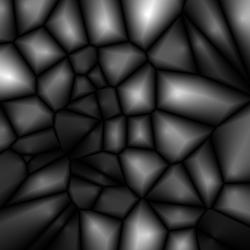
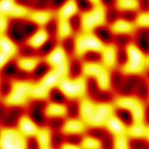

# gradient-generator

A small JavaScript library for creating smooth gradients.

## What is it?
A library which you can use to map values between 0.0 and 1.0 to colors by defining gradients. For example you can turn the output of a [noise](https://github.com/josephg/noisejs) function to a nicely colored image:

 

## Getting Started
Download the [development][max] or the [minified][min] version.

[max]: https://raw.githubusercontent.com/zsoltc/gradient-generator/master/bin/gradient-generator.dev.js
[min]: https://raw.githubusercontent.com/zsoltc/gradient-generator/master/bin/gradient-generator.js

Example usage:

```html
<script src="gradient-generator.dev.js"></script>
<script>
// Creates a fire gradient with 4 color stops (black -> red -> yellow -> white).
// The gradient ranges from 0 to 1 (0: black, 0.33: red, 0.66: yellow, 1: white).
var gradient = GradientGenerator.createGradient('#000000 #c50106 #f5f100 #ffffff');

// Gets color at 0.4 (somewhere between red and yellow).
// RGB values are between 0 and 1.
var color = gradient.getColorAt(0.4);
console.log('red: ' + color.r + ' green: ' + color.g + ' blue: ' + color.b);

// Gets color in bytes.
// RGB values are between 0 and 255.
color = gradient.getColorBytesAt(0.4);
console.log('red: ' + color.r + ' green: ' + color.g + ' blue: ' + color.b);

// Gets color in hex.
color = gradient.getColorHexAt(0.4);
console.log(color);
</script>
```
There are also some canvas examples which might be more interesting than logging RGB values in the console. :)

## AMD, CommonJS
The project is built with [Browserify](http://browserify.org) `--standalone` option which generates [UMD](http://davidbcalhoun.com/2014/what-is-amd-commonjs-and-umd/) modules, so there should be no problem using this library in these environments.
